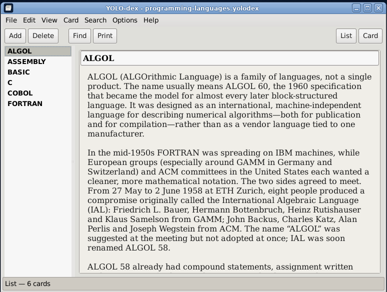

# YOLO-dex



An **index-card stack** for The Lunduke Computer Operating System (LCOS). The window is Windows 3.x / 95 Cardfile, not a Markdown notebook.

Binary: `yolodex`. Unlicense.

LCOS itself: [https://github.com/BryanLunduke/LCOS](https://github.com/BryanLunduke/LCOS)

## Status

**M2 in tree.** Stack file plus Find / Find Next / Go To, prev/next card, and restore last stack + card from `~/.config/yolodex/yolodex.ini`. Sample: `data/samples/recipes.yolodex`. Print and Card view come later.

| Doc | What |
|---|---|
| [DEVELOPMENT.md](DEVELOPMENT.md) | Locked decisions, architecture, milestones M0–M6 |

## Build

```
sudo apt install build-essential meson ninja-build pkg-config g++ libgtkmm-3.0-dev libxml2-dev
meson setup build
meson compile -C build
./build/yolodex
```

## License

[The Unlicense](https://unlicense.org). See [UNLICENSE](UNLICENSE).
